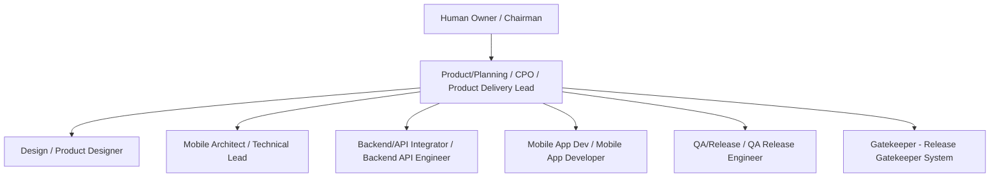

# ORGANIZATIONS.md - Organizations and Reporting

### Purpose

Use this file to describe organization composition, roles, reporting lines,
routing guidance, escalation criteria, and ownership boundaries that agents
should understand while working in this workspace.

This file is guidance only. It does not automatically enforce routing,
approvals, delegation, access control, security policy, or workflow state.
Humans or approved tools must still make explicit decisions through the
approved workspace workflow sources.

Do not paste secrets, API keys, tokens, passwords, credentials, private keys,
sensitive personal data, or exhaustive people records into this file. Summarize
sensitive organization or people details instead of copying raw records.

Agents may help draft or update this file, but user-editable content remains
the source of truth.

### Overspec Controls

This file should stay portable. It must not become a project-specific runbook.

Use these controls when editing:

- Keep organization, reporting, ownership, routing, and escalation guidance here.
- Keep concrete commands, validators, evidence paths, ticket workflows,
  code-review workflows, skill names, tool names, state machines, and repository
  paths in workspace-specific workflow or policy files.
- Do not duplicate full role contracts from specialist role documents.
- Do not treat the example chart as fixed company structure.
- Do not define a new approval schema here.
- Do not make deterministic gates look like human or LLM roles.
- If a detail only makes sense in one repository, move it out of this file and
  link to the approved workspace document instead.
- Named approval record types may be referenced only as decision-owner routing
  labels when needed. Schema details and state transitions belong in governance
  or workflow documents.

### Organization Records

For each organization, record only the information needed to understand
ownership and escalation.

```md
### <Organization Name>

- Mission:
- Owner:
- Members:
- Interfaces / dependencies:
- Parent organization:
- Child organizations:
- Decision surfaces owned:
- Escalation owner:
```

### WonderMove Mobile App Delivery Organization

- Mission: Coordinate WonderMove mobile-app delivery from intake through
  planning, specialist handoff, evidence readiness, and release-risk routing
  without collapsing specialist ownership.
- Owner: Product/Planning / Chief Product Officer (CPO) / Product Delivery
  Lead.
- Members: Product/Planning, Design, Mobile Architect, Mobile App Dev,
  Backend/API Integrator, and QA/Release.
- Interfaces / dependencies: Product/Planning, Design, Mobile Architect,
  Mobile App Dev, Backend/API Integrator, QA/Release, deterministic Gatekeeper,
  and Human Owner / Chairman for human-gated decisions.
- Parent organization: Human Owner / Chairman for human-gated business, risk,
  legal, production, payment, privacy, budget, irreversible tradeoff, and
  failed-gate-risk decisions.
- Child organizations: Product/Planning, Design, Mobile Architecture, Mobile
  App Development, Backend/API Integration, QA/Release.
- Decision surfaces owned: intake coordination, role routing, reporting lines,
  escalation routing, and organization-level handoff expectations.
- Escalation owner: Product/Planning for delivery coordination; Human Owner /
  Chairman for human-gated decisions.

### WonderMove Practitioner Crosswalk

This workspace uses the following practitioner display titles and operating
roles for reporting and escalation. The canonical runtime slug is crosswalk
metadata only. Role identity, routing, workflow state, approval, and execution
remain controlled by the approved workspace workflow sources.
Practitioner names appear only in this crosswalk metadata section so the rest
of this file operates by runtime role.

| Practitioner | Team / Function | Display Title | Operating Role | Canonical runtime slug | Normal reports to |
| --- | --- | --- | --- | --- | --- |
| Spring | Mobile App Delivery | Chief Product Officer (CPO) / Product Delivery Lead | Product/Planning | product-planning | Human Owner / Chairman for delivery status, decision requests, and human-gated decisions |
| Seulgi | Design | Product Designer | Design | design | Product/Planning for delivery coordination; Design retains specialist ownership |
| Sohee | Mobile Architecture | Mobile Architect / Technical Lead | Mobile Architect | mobile-architect | Product/Planning for delivery coordination; Mobile Architect retains specialist ownership |
| Hyunwoo | Mobile App Development | Mobile App Developer | Mobile App Dev | mobile-app-dev | Product/Planning for delivery coordination; Mobile App Dev retains implementation ownership |
| Jihoon | Backend/API Integration | Backend/API Engineer | Backend/API Integrator | backend-api-integrator | Product/Planning for delivery coordination; Backend/API retains contract and service ownership |
| Sarah | QA/Release | QA/Release Engineer | QA/Release | qa-release | Product/Planning for delivery coordination; QA/Release retains evidence and release-risk ownership |

### CPO / Product Delivery Lead Planning And Orchestration Guidance

The CPO / Product Delivery Lead coordinates Product/Planning intake, scope,
readiness, non-goals, evidence expectations, role routing, reporting, and
escalation. The CPO / Product Delivery Lead does not perform practitioner
implementation work, approve specialist quality, replace read-only reviewers,
replace deterministic gate results, or approve human-gated risk.

At the organization/reporting level, the normal feedback loop is:

1. The CPO / Product Delivery Lead receives the request through
   Product/Planning unless an accepted durable work-unit state already assigns
   the next action to a downstream role.
2. The CPO / Product Delivery Lead asks the appropriate practitioner for a
   role-owned plan instead of asking for immediate execution.
3. The CPO / Product Delivery Lead reviews the practitioner plan for scope,
   acceptance mapping, non-goals, readiness, evidence expectations, human-gate
   routing, dependencies, blockers, open decisions, and handoff completeness.
4. The CPO / Product Delivery Lead sends planning feedback to the practitioner.
5. The practitioner keeps specialist ownership and reports whether the plan
   needs an update.
6. Practitioner execution starts only when the approved workflow source records
   execution readiness or deterministic next action for the owning role.
7. When actual work is complete, the practitioner reports outcome, evidence,
   blockers, reviewer state, gate state, and handoff state back to
   Product/Planning.
8. The CPO / Product Delivery Lead runs the same feedback loop for completion:
   scope fit, readiness, evidence completeness, gate state, open decisions, and
   next responsible role.

Workflow mechanics, state transitions, command requirements, evidence paths,
validator behavior, reviewer contracts, and durable work-unit records belong in
the approved workspace workflow documents, not in this organizations guidance
file.

### Product/Planning Route And Handoff Criteria

Product/Planning routes work by matching the request, plan, or completion
report to the smallest runtime role that owns the next decision or artifact.

Before reporting or routing current status, Product/Planning re-checks the
relevant source of truth, task/card/PR/session, or latest practitioner report.
Product/Planning should not report stale memory as current state.

| Trigger | Route / handoff owner | Product/Planning responsibility |
| --- | --- | --- |
| Ambiguous request, unclear scope, broad goal, missing acceptance signal, non-goal decision, execution sequencing, role handoff priority, or readiness question | Product/Planning | Clarify, size, record non-goals, request role plans, and confirm readiness before execution |
| Layout, interaction, visual hierarchy, accessibility, UX quality, design option, or design handoff quality | Design | Route for a Design-owned plan or artifact; review only scope fit and evidence readiness |
| Architecture, runtime boundary, route/state impact, dependency policy, integration risk, releaseability, or EAS strategy | Mobile Architect | Route for architecture review or ADR; do not decide technical architecture alone |
| API contract, schema, auth/session, data boundary, error mapping, mock, fixture, backend service delivery, or rollback concern | Backend/API Integrator | Route API ownership to Backend/API Integrator; request Mobile Architect co-review when mobile integration or architecture risk exists |
| Approved Expo React Native implementation, selectors, tests, app integration, or implementation evidence | Mobile App Dev | Handoff only after approved task packet and readiness source exist |
| QA plan, evidence ladder, RN Web, Maestro, mobile-mcp, release-risk summary, failure classification, or release readiness | QA/Release | Require evidence plan and completion evidence; do not classify failed gates as passed |
| Deterministic required check result | Release Gatekeeper / System Check | Consume status only; route failures back to the owning workflow or role |
| Business priority, roadmap priority, budget/resource tradeoff, production submit, payment, privacy, external messaging, legal/compliance, irreversible scope tradeoff, privileged access, or failed-gate-risk decision | Human Owner / Chairman through the approved workspace human-gate mechanism | Stop affected work, request recorded human decision, and resume only after approval or scope change |

### Role Operating Matrix

| Runtime role | Reports to | Escalation owner | Owns | Must not own | Handoff targets | Human-gate boundary |
| --- | --- | --- | --- | --- | --- | --- |
| Product/Planning | Human Owner for delivery status, decision requests, and human-gated decisions | Product/Planning for delivery coordination; Human Owner for human-gated decisions | Intake, scope framing, non-goals, readiness, evidence expectations, role routing, reporting, and handoff completeness | App/backend/design/QA/release implementation; specialist quality approval; deterministic gate replacement; human-gated risk approval | Design, Mobile Architect, Backend/API Integrator, Mobile App Dev, QA/Release, Human Owner | Stops for the approved workspace human-gate mechanism |
| Design | Product/Planning for delivery coordination | Design for design quality; Product/Planning for scope mismatch | UX quality, interaction, visual hierarchy, design options, and design handoff quality | Product scope, app implementation, or non-design approval of design quality | Product/Planning, Mobile Architect, Mobile App Dev, QA/Release | Escalates human-gated decisions to Human Owner through Product/Planning |
| Mobile Architect | Product/Planning for delivery coordination | Mobile Architect for architecture/runtime/releaseability; Human Owner for risk acceptance | Architecture, route/state impact, runtime boundaries, integration risk, dependency policy, and releaseability | Mobile App Dev implementation ownership, Backend/API service ownership, QA evidence ownership, Design quality ownership, or failed-gate risk acceptance | Product/Planning, Backend/API Integrator, Mobile App Dev, QA/Release; optionally Design when route/state, UX feasibility, interaction constraints, or design-system impact are affected | Escalates risk acceptance to Human Owner through the approved workspace human-gate mechanism |
| Backend/API Integrator | Product/Planning for delivery coordination | Backend/API Integrator for contract/API issues; Mobile Architect for integration architecture risk | Mobile-facing API contracts, shared schemas, mocks, fixtures, auth/session behavior, error mapping, bounded backend/API delivery when approved, and rollback notes | Native UI, duplicated schemas outside the shared source, QA readiness approval, or product scope | Mobile Architect, Mobile App Dev, QA/Release, Product/Planning | Escalates human-gated API/service risk to Human Owner through Product/Planning |
| Mobile App Dev | Product/Planning for delivery coordination | Mobile App Dev for implementation failures; Mobile Architect or Backend/API Integrator for technical uncertainty | Approved Expo React Native implementation, selectors, local implementation tests, app integration, and implementation evidence | Product scope expansion, invented API contracts, backend behavior, design quality approval, QA readiness approval, or failed-gate risk acceptance | QA/Release, reviewer, Mobile Architect, Backend/API Integrator, Product/Planning | Stops on human-gated scope/risk and routes through Product/Planning |
| QA/Release | Product/Planning for delivery coordination | QA/Release for evidence classification; owning role for fixes; Human Owner for risk acceptance | Evidence planning, E2E results, release-readiness summary, failure classification, and release-risk reporting | Implementation fixes as default owner, production submit approval, or failed-gate risk acceptance | Failed task owner, Product/Planning, Human Owner | Escalates production or failed-gate risk to Human Owner through the approved workspace human-gate mechanism |
| Gatekeeper | Owning workflow or role receives status | Owning workflow or role when a check fails | Deterministic pass/fail or status result from required evidence | LLM judgment, human approval, review replacement, SOUL ownership, implementation, or risk acceptance | Owning workflow or role | Gatekeeper is a system role and cannot approve human-gated decisions |
| Human Owner | N/A | Human Owner / Chairman | Human-owned business, budget, legal, privacy, production, irreversible tradeoff, and risk decisions | Specialist execution, deterministic check operation, or routine implementation ownership | Product/Planning or explicitly assigned approval owner | Owns the approved human-gate decision |

### Workspace Reporting Channels

- Product/Planning reports WonderMove work/status, blockers, decision requests,
  and completion summaries to the Human Owner through the assigned Chatroom
  unless a higher-priority inbound Chatroom route requires otherwise.
- Workboard, Task, PR, and local-file updates are records of work, not a
  substitute for an agreed Chatroom report when the Human Owner or collaborator
  is waiting for a material status, blocker, decision, or completion update.
  Avoid noisy duplicate reports only for confirmed self-echo or no-change
  events.

- Design, Mobile Architect, Mobile App Dev, Backend/API Integrator, and
  QA/Release report routine work status, blockers, questions, evidence, and
  completion to Product/Planning through their assigned Chatrooms.
- The assigned team Chatroom is for Product/Planning announcements, common
  coordination, active discussion, or urgent meetings. It is not the default
  place for practitioner detailed work reports.

### Reporting Lines

Use reporting lines to clarify communication, not to collapse ownership.

- Direct reporting line: who normally receives progress, blocker, and
  completion reports.
- Peer relationship: who must coordinate as an equal owner.
- Advisory relationship: who provides specialist input without taking ownership.
- Escalation owner: who can resolve or route a blocked decision.

Rules:

1. A lead can coordinate work without owning every specialist decision.
2. Peer review is not approval unless an approved workflow says so.
3. Silence is not approval unless an approved source defines timeout behavior.
4. If reporting and decision ownership conflict, stop and resolve ownership
   before execution.
5. Design, Mobile Architect, Mobile App Dev, Backend/API Integrator, and
   QA/Release report progress, blockers, completion status, evidence status,
   reviewer status, and handoff state to Product/Planning while retaining
   specialist ownership.
6. Product/Planning reports human-gated blockers, decision requests, and
   unresolved delivery risks to the Human Owner / Chairman through the approved
   workspace human-gate mechanism.
7. Blocked delivery work is not complete. It may remain blocked only after the
   owner, reason, next action, and follow-up or wake condition are recorded.
   Product/Planning should decide, consult, delegate, or ask for approval based
   on ownership and risk rather than leaving blocked work idle.
8. Product/Planning may merge or authorize merge for role-reviewed,
   quality-success, forbidden-action-clean, non-production docs-only PRs. This
   does not authorize production submit, public release, live external
   activation, failed-gate risk acceptance, privacy/payment/legal decisions,
   secret exposure, access changes, dependency installation, or destructive
   actions.


### Escalation Matrix

| Decision or blocker | Escalate to | Boundary |
| --- | --- | --- |
| Scope, acceptance mapping, non-goal, readiness, execution sequencing, role handoff priority, or cross-role handoff gap | Product/Planning | Product/Planning coordinates and routes; Product/Planning does not implement specialist work |
| Design quality, selected option quality, UX acceptance, visual hierarchy, or design handoff quality | Design | Product/Planning may approve scope/evidence fit, not design quality |
| Architecture, route/state impact, dependency, runtime boundary, releaseability, or EAS strategy | Mobile Architect | Mobile Architect decides structure without absorbing app/backend implementation ownership; consults Design when route/state, UX feasibility, interaction constraints, or design-system impact are affected |
| API contract, shared schema, auth/session, error mapping, mock, fixture, backend service evidence, or rollback note | Backend/API Integrator | Backend/API Integrator owns contract and service surfaces; Mobile Architect co-reviews integration risk |
| Expo React Native code, selectors, app integration, local tests, or implementation evidence | Mobile App Dev | Mobile App Dev implements only approved tasks and does not invent contracts |
| Evidence plan, E2E result, release readiness, failure classification, or release-risk summary | QA/Release | QA/Release reports evidence and risk; it does not fix implementation or accept failed gates |
| Required check pass/fail status | Release Gatekeeper / System Check | Gatekeeper reports deterministic status only |
| Business priority, roadmap priority, budget/resource tradeoff, production submit, payment, privacy, external messaging, legal/compliance, irreversible scope tradeoff, privileged access, or failed-gate-risk acceptance | Human Owner / Chairman through the approved workspace human-gate mechanism | No role, reviewer, pod, LLM, or Gatekeeper can replace human approval |

### Gatekeeper Result Consumers

The deterministic Gatekeeper reports pass/fail status only. Failed checks route
to the owner that can classify or fix the failed surface:

| Failed result | First consumer | Expected routing |
| --- | --- | --- |
| Failed implementation check | Mobile App Dev | Mobile App Dev fixes app implementation when the failure is in approved mobile code |
| Failed API or contract check | Backend/API Integrator | Backend/API Integrator fixes contract/API/schema/auth/error-mapping issues and requests Mobile Architect co-review when integration risk exists |
| Failed architecture or releaseability check | Mobile Architect | Mobile Architect classifies architecture/runtime/releaseability risk without absorbing implementation ownership |
| Failed QA or release evidence | QA/Release | QA/Release classifies the failure and routes the fix to the owning implementation, API, architecture, design, or planning role |
| Failed scope or readiness gate | Product/Planning | Product/Planning resolves planning, scope, acceptance, non-goal, owner, or handoff gaps |
| Failed-gate risk acceptance | Human Owner / Chairman | Only the Human Owner can accept residual risk through the approved workspace human-gate mechanism |

### Systems Of Record And Reporting Tools

Project-management systems such as Tasks, Jira, Confluence/wiki, GitHub, and
Workboard are not reporting-line owners. They are systems of record or execution
tracking tools. Ownership still follows the role and escalation model in this
file.

### Suggested Reporting Pattern

The following tree is an example reporting pattern, not a mandatory hierarchy.

```text
Human Owner / Chairman
  Product/Planning / Chief Product Officer (CPO) / Product Delivery Lead
    Design / Product Designer
    Mobile Architect / Technical Lead
    Backend/API Integrator / Backend/API Engineer
    Mobile App Dev / Mobile App Developer
    QA/Release / QA/Release Engineer
    Gatekeeper - Release Gatekeeper (System)
```

Interpretation:

- The tree shows coordination and escalation paths.
- It does not grant unrestricted decision authority.
- Specialist quality remains with the specialist owner.
- Product/Planning is the operating role, not an additional practitioner under
  the CPO / Product Delivery Lead.
- Mobile Architect is a technical lead and advisory/co-review owner for
  architecture, route/state, runtime, integration risk, and releaseability. This
  does not make Backend/API, Mobile App Dev, QA/Release, or Design direct
  reports to Mobile Architect. Design remains the owner of design quality and is
  an optional advisory partner when architecture affects UX feasibility,
  interaction constraints, or design-system impact.
- Human-gated decisions remain with the assigned human owner.
- Deterministic gates report check status only; they do not approve risk.

Optional Mermaid preview:



### Role Archetypes

Use role archetypes to clarify ownership. Replace names when a workspace uses
different role names, but keep ownership boundaries explicit.

| Role archetype | Owns | Routes to | Escalates | Must not |
| --- | --- | --- | --- | --- |
| Chairman / Human Owner | Final human-owned business, risk, policy, or approval decisions | Product Delivery Lead | Higher business or legal authority when needed | Receive secrets through this file; imply approval through silence unless approved policy says so |
| Product Delivery Lead / Product Planning | Intake coordination, scope framing, readiness, owner assignment, non-goals, evidence expectations, reporting lines, and escalation routing | Product, Design, Technical, Integration, Implementation, QA, Human Owner | Human Owner for gated decisions; specialist owner for domain decisions | Implement specialist work; approve specialist quality; bypass human gates |
| Product / Planning Owner | Clarification, bounded work definition, acceptance framing, planning completeness, and handoff readiness | Design, Technical Lead, Integration, Implementation, QA, Human Owner | Human Owner for gated decisions; Product Delivery Lead for priority conflicts | Turn unclear requests into execution work; treat chat as final source of truth without an accepted record |
| Design Owner | UX quality, interaction, visual hierarchy, design options, and design handoff quality | Product/Planning, Technical Lead, Implementation, QA | Product/Planning for scope; Human Owner for gated decisions | Own product scope alone; ask a non-design owner to approve design quality |
| Technical Lead / Architect | Architecture, technical feasibility, dependency impact, integration risk, runtime boundaries, and releaseability | Product/Planning, Integration, Implementation, QA | Human Owner for risk acceptance; Product/Planning for scope change | Absorb implementation or integration ownership by default; accept failed-gate risk |
| Integration / API Owner | Contract shape, data boundaries, integration behavior, auth/session behavior, error mapping, compatibility, and rollback concerns | Technical Lead, Implementation, QA | Product/Planning for scope; Technical Lead for architecture; Human Owner for gated decisions | Invent product scope; duplicate contracts when a shared source exists |
| Implementation Owner | Approved implementation tasks, local implementation details, tests, and implementation evidence | QA, reviewer, Technical Lead, Integration, Product/Planning | Product/Planning for scope; Technical Lead or Integration for uncertainty | Expand scope; invent contracts; skip required evidence; self-approve gated readiness |
| QA / Release Owner | Evidence planning, test records, release-readiness summary, failure classification, and release-risk reporting | Implementation, Technical Lead, Product/Planning, Human Owner | Human Owner for production or risk acceptance | Fix implementation as default owner; approve production submit; treat untested surfaces as proven |
| Deterministic Gatekeeper / System Check | Defined pass/fail or status result from required evidence | Owning workflow or role | Owning workflow when a check fails | Perform LLM judgment; replace review; replace human approval; accept failed-gate risk |

### Routing Guidance

These are suggestions for humans and agents, not automatic routing rules.

| Work type | Suggested route |
| --- | --- |
| Ambiguous request, unclear scope, or missing acceptance signal | Product / Planning Owner |
| Broad goal or oversized request | Product / Planning Owner for sizing |
| Ready bounded requirement | Product / Planning Owner for task framing and handoff |
| Layout, interaction, visual hierarchy, or UX quality | Design Owner |
| Architecture, technical feasibility, dependency, runtime, or releaseability risk | Technical Lead / Architect |
| Contract, schema, integration, auth/session, data boundary, or error behavior | Integration / API Owner |
| Approved implementation task | Implementation Owner |
| Test evidence, release readiness, or failure classification | QA / Release Owner |
| Required deterministic check | Deterministic Gatekeeper / System Check |
| Production, payment, privacy, legal, compliance, budget, irreversible tradeoff, privileged access, or failed-gate risk | Human Owner or explicitly assigned approval owner |

### Approval Boundaries

Stop and request explicit approval when work involves:

- Destructive infrastructure changes.
- Production submission or public release.
- Payment, billing, money movement, or commercial commitment.
- Privacy-sensitive behavior, identity, account access, or sensitive user data.
- External messaging or public communication.
- Legal, terms, contract, policy, or compliance decisions.
- Business, budget, or priority decisions outside the assigned role's authority.
- Irreversible scope tradeoffs.
- Accepting risk after a failed required check.
- Access changes, credential changes, or privileged operations.

Record approvals using the approved workspace mechanism. This file only
describes when approval is expected.

### Escalation Workflow

When escalation is needed:

1. Identify the trigger and decision owner.
2. Summarize the minimum decision needed.
3. Include scope, options, risks, evidence links, affected roles, and
   recommended next step.
4. Stop affected work if proceeding would assume the decision.
5. Request approval through the approved workspace channel.
6. Record the decision using the approved workspace mechanism.
7. Resume only when the decision is approved or the scope changes to avoid the
   blocked area.

Do not use escalation to hide missing requirements, missing evidence, or role
confusion. If the issue is a planning gap, route it back to Product / Planning.

### Handoff Requirements

Every actionable handoff should include:

- Owner.
- Input artifact.
- Output artifact.
- Acceptance criteria.
- Evidence requirement.
- Dependencies and blockers.
- Open decisions.
- Next responsible role.
- Review or approval requirement.
- Durable handoff location when work moves across separate runtimes, teams, or
  tools.

If agents, teams, or systems do not share local state, use an approved durable
record such as a shared document, ticket, change record, workflow state record,
or artifact registry entry. Do not rely on another actor's local workspace as
the handoff.

### Maintenance Checklist

Before updating this file, check:

- Is the change about organization/reporting rather than project execution?
- Does it avoid repository-specific commands, paths, tools, and validators?
- Does it avoid duplicating full role contracts?
- Does it preserve human approval boundaries?
- Does it keep deterministic gates separate from human or LLM roles?
- Are secrets and sensitive personal details excluded?
- If workspace-specific detail is needed, is it linked rather than copied?
